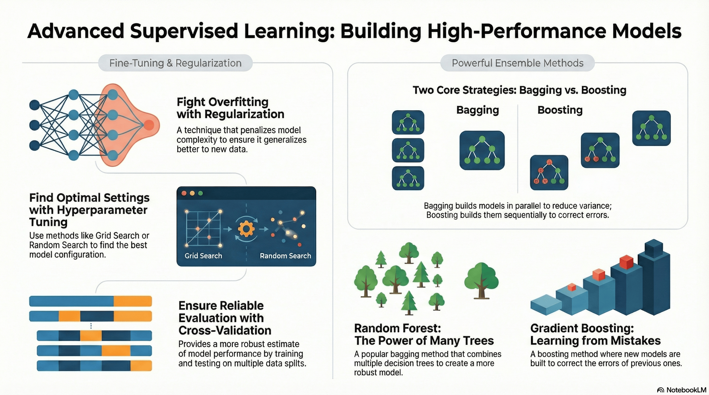

# 3.4 Supervised Learning Advanced

## Lesson Overview

## Dependencies

Refer to the following markdown file for the respective sections of the class:

- [Self Studies](./studies.md)
- [Lesson](./lesson.md)
- [Assignment](./assignment.md)
- [Quiz](./quiz.md)
- [Reference](./reference.md)

## Lesson Objectives

* Apply L1 (Lasso), L2 (Ridge) and Elastic Net regularization techniques to regression models to control model complexity and mitigate overfitting.
* Implement machine learning workflow using `sklearn` pipelines with hyperparameter optimization via Cross-Validation and Grid Search.
* Analyze the foundational mechanics of Decision Trees, including splitting criteria like Gini Impurity and Entropy.
* Evaluate distinct ensemble learning strategies by contrasting Bagging and Boosting methodologies and applying advanced algorithms, such as Random Forest, Gradient Boosting and LightGBM, to improve predictive performance.

## Lesson Plan

| Duration | What                    | How or Why                                                                        |
| -------- | ----------------------- | --------------------------------------------------------------------------------- |
| - 5mins  | Start zoom session      | So that learners can join early and start class on time.                          |
| 20 mins  | Activity                | Recap on self-study and prework materials.                                        |
| 40 mins  | Code-along              | Part 1: Regularization, Hyperparameters Tuning, Cross Validation and Grid Search. |
|          | **1 HR MARK**           |
| 30 mins  | Code-along              | Part 2: Model training workflow.                                                  |
| 10 mins  | Break                   |                                                                                   |
| 20 mins  | Code-along              | Part 3: Decision Trees.                                                           |
|          | **2 HR MARK**           |
| 50 mins  | Code-along              | Part 4: Bagging vs Boosting, Random Forest, Gradient Boosting, LightGBM.          |
| 10 mins  | Briefing / Q&A          | Brief on references, assignment, quiz and Q&A.                                    |
|          | **END CLASS 3 HR MARK** |
